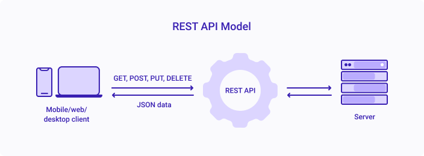

## Singleton and Collection Resources
A resource can be a singleton or a collection.

For example, `users` is a collection resource and `user` is a singleton resource.

We can identify `users` collection resource using the URI `/users`. We can identify a single `user` resource using the URI `/users/{userId}`.

```javascript
/users			//is a collection resource

/users/{id}		// is a singleton resource
```

## Use Plural nouns
Use plural when possible unless they are singleton resources.

Here are a few examples to show how the endpoints should look like,


|HTTP method  | URI                   |
|-------------|-----------------------|
|POST         |/users                 |
|GET          |/users	                |
|GET          |/users/123             |
|PUT          |/users/123             |
|PATCH        |/users/123             |
|DELETE       |/users/123             |
|GET          |/users?name=John&age=30|


## Collection and Sub-collection Resources
A resource may contain sub-collection resources also.

For example, sub-collection resource `accounts` of a particular “user” can be identified using the URI `/users/{userId}/accounts` .

Similarly, a singleton resource `account` inside the sub-collection resource `accounts` can be identified as follows: `/users/{userId}/accounts/{accountId}`.
```javascript
/customers						//is a collection resource

/customers/{id}/accounts		// is a sub-collection resource
```


## Use nouns to represent resources
RESTful URI should refer to a resource that is a thing (noun) instead of referring to an action (verb) because nouns have properties that verbs do not have – similarly, resources have attributes. Some examples of a resource are:

Users of the system
User Accounts
Network Devices etc.
and their resource URIs can be designed as below:

```javascript
/device-management/managed-devices 

/device-management/managed-devices/{device-id} 

/user-management/users

/user-management/users/{id}
```

## Consistency is the key
Use consistent resource naming conventions and URI formatting for minimum ambiguity and maximum readability and maintainability.

## Use forward slash (/) to indicate hierarchical relationships
The forward-slash (/) character is used in the path portion of the URI to indicate a hierarchical relationship between resources. e.g.

```javascript
/device-management
/device-management/managed-devices
/device-management/managed-devices/{id}
/device-management/managed-devices/{id}/scripts
/device-management/managed-devices/{id}/scripts/{id}
```

## Do not use trailing forward slash (/) in URIs
As the last character within a URI’s path, a forward slash (/) adds no semantic value and may confuse. It’s better to drop it from the URI.

```javascript
http://api.example.com/device-management/managed-devices/ 
http://api.example.com/device-management/managed-devices         /*This is much better version*/
```

## Use hyphens (-) to improve the readability of URIs
To make your URIs easy for people to scan and interpret, use the hyphen (-) character to improve the readability of names in long-path segments.

```javascript
http://api.example.com/devicemanagement/manageddevices/
http://api.example.com/device-management/managed-devices 	/*This is much better version*/
```

## Use lowercase letters in URIs
When convenient, lowercase letters should be consistently preferred in URI paths.

```javascript
http://api.example.org/my-folder/my-doc     // GOOD
HTTP://API.EXAMPLE.ORG/my-folder/my-doc     // BAD
http://api.example.org/My-Folder/my-doc     // BAD
```

## Do not use file extensions
File extensions look bad and do not add any advantage. Removing them decreases the length of URIs as well. No reason to keep them.

Apart from the above reason, if you want to highlight the media type of API using file extension, then you should rely on the media type, as communicated through the Content-Type header, to determine how to process the body’s content.

```javascript
/device-management/managed-devices.xml  /*Do not use it*/

/device-management/managed-devices 	/*This is correct URI*/
```

## Never use CRUD function names in URIs
We should not use URIs to indicate a CRUD function. URIs should only be used to identify the resources and not any action upon them uniquely.

We should use HTTP request methods to indicate which CRUD function is performed.

```javascript
HTTP GET /device-management/managed-devices  			//Get all devices
HTTP POST /device-management/managed-devices  			//Create new Device

HTTP GET /device-management/managed-devices/{id}  		//Get device for given Id
HTTP PUT /device-management/managed-devices/{id}  		//Update device for given Id
HTTP DELETE /device-management/managed-devices/{id}  	//Delete device for given Id
```

## Use HTTP methods to communicate intent

One of the key principles of REST APIs is the use of standard HTTP methods to communicate the intent of the request.

The following table helps you in understanding the REST API Verbs:

| REST Verb | Action                                               |
| --------- | ---------------------------------------------------- |
| GET       | Fetches a record or set of resources from the server |
| OPTIONS   | Fetches all available REST operations                |
| POST      | Creates a new set of resources or a resource         |
| PUT       | Updates or replaces the given record                 |
| PATCH     | Modifies the given record                            |
| DELETE    | Deletes the given resource                           |

## Use query component to filter URI collection
Often, you will encounter requirements where you will need a collection of resources sorted, filtered, or limited based on some specific resource attribute.

For this requirement, do not create new APIs – instead, enable sorting, filtering, and pagination capabilities in resource collection API and pass the input parameters as query parameters. e.g.

```javascript
/device-management/managed-devices
/device-management/managed-devices?region=USA
/device-management/managed-devices?region=USA&brand=XYZ
/device-management/managed-devices?region=USA&brand=XYZ&sort=installation-date
```

## Do not Use Verbs in the URI
It is not correct to put the verbs in REST URIs. REST uses nouns to represent resources, and HTTP methods (GET, POST, PUT, DELETE, etc.) are then used to perform actions on those resources, effectively acting as verbs.

If we use verbs in the URI, we are most probably creating an RPC-style method call having a JSON or XML request/response format. It would be incorrect to call it REST.

```javascript
/device-management/managed-devices/{id}/scripts/{id}/execute    //It is RPC, and not REST
```

In cases, where we need to perform some action that does not apply naturally to the definition of resources, we can create the custom URIs that can be considered nouns/resources and perform an action over them.

For example, instead of invoking /scripts/{id}/execute , we can create a resource for all scripts currently executing and submit a script to it if we want to execute a script.

```javascript
/device-management/managed-devices/{id}/scripts/{id}/execute	//DON't DO THIS!

/device-management/managed-devices/{id}/scripts/{id}/status		//POST request with action=execute
```

## Version Your APIs
Versioning your APIs is crucial for providing a smooth upgrade path and maintaining backward compatibility when making changes. It ensures that clients can adapt to new features and improvements without disrupting existing functionality. Here are some best practices for versioning your APIs:

- Use URL Versioning:

  Incorporate the API version directly into the URL to distinguish different versions. For example:

  ```javascript
  http://api.example.com/v1/store/employees/{emp-id}
  http://api.example.com/v1/store/items/{item-id}
  http://api.example.com/v2/store/employees/{emp-id}/address
  ```
- API Documentation:

  Clearly document each API version, specifying the changes, additions, and deprecations introduced in each version. This helps users understand the differences and plan for migration.

- Semantic Versioning:

  Consider adopting Semantic Versioning (SemVer) to indicate the extent of changes in each API version. SemVer follows the format of MAJOR.MINOR.PATCH, where:

  `MAJOR` version is incremented for incompatible changes.    
  `MINOR` version is incremented for backward-compatible additions.   
  `PATCH` version is incremented for backward-compatible bug fixes.   
  Deprecation Policy:

Clearly communicate the deprecation policy for older API versions, informing users when a version will no longer be supported. This allows clients to plan their migration to the latest version.